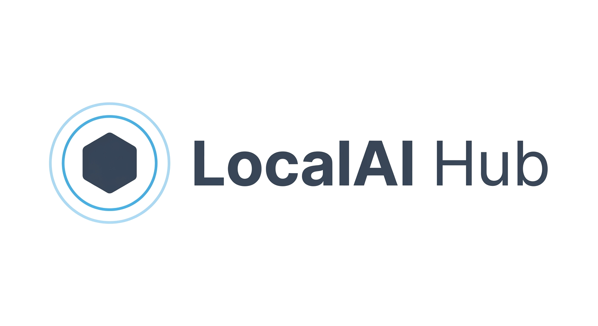
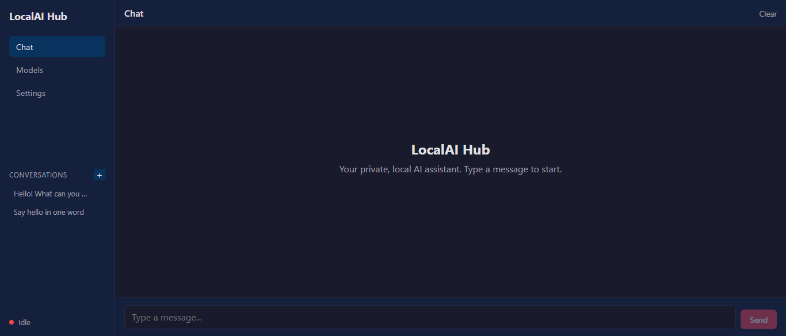
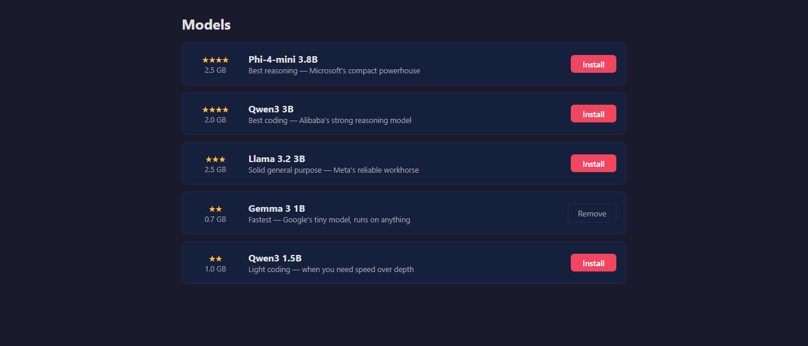
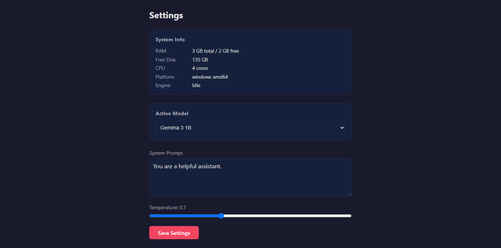

<div align="center">



**Run open-source LLMs on any Windows PC — no Docker, no Python, no cloud, no terminal.**

[](https://github.com/delta574/localai-hub/actions/workflows/build.yml)
[](https://opensource.org/licenses/MIT)
[](https://go.dev)
[](https://github.com/delta574/localai-hub/actions)
[](https://github.com/delta574/localai-hub/actions)
[](https://github.com/delta574/localai-hub/actions)

[Quick Start](#-quick-start) · [Features](#-features) · [API](#-for-developers) · [Build](#-build-from-source) · [FAQ](#-faq)

</div>

One 3.5 MB `.exe`. Double-click. Browser opens. Chat.

LocalAI Hub is a single-binary desktop application that downloads, manages, and runs large language models locally. Designed for **4-8 GB RAM machines**, portable USB operation, and users who want a private AI assistant without the setup hassle.

---

## ⚡ Quick Start

### Option A: Portable .exe (recommended)

1. Download `LocalAI.exe` from the [Actions tab](https://github.com/delta574/localai-hub/actions) (click the latest run, download the artifact).
2. Create a folder anywhere — desktop, USB drive, doesn't matter.
3. Drop `LocalAI.exe` into that folder.
4. Double-click `LocalAI.exe`. A terminal window opens and your browser launches to `http://localhost:8080`.
5. In the **Setup Wizard**, click **Install** on any model (the first one is recommended for your PC).
6. Wait for the download to finish. The wizard closes and you're on the Chat page.
7. Type a message and press **Enter** (or click **Send**). The AI responds token-by-token.

### Option B: NSIS Installer

1. Download `LocalAI_Hub_Setup.exe` from the [Actions tab](https://github.com/delta574/localai-hub/actions) (click the latest run, download the artifact).
2. Run the installer — it adds a Start Menu shortcut and an uninstaller entry.
3. Launch from Start Menu. Same experience as above.

> [!TIP]
> All data (`models/`, `conversations/`, `config.json`) is stored alongside the `.exe`. To switch PCs, copy the entire folder to a USB drive.

---

## ✨ Features

- **Single binary** — 3.5 MB `.exe`, zero dependencies. No Electron, no Node.js, no Python runtime.
- **Auto-setup** — Downloads `llama-server` (inference engine) and models from HuggingFace on first run.
- **One-click model install** — Pick from 5 curated GGUF models sized for 2–4 GB RAM. Download with progress bar, auto-resume on interruption.
- **Chat UI** — Streaming token-by-token responses, markdown rendering, conversation history.
- **Conversation management** — Create, select, and delete conversations. Auto-saved as JSON files.
- **OpenAI-compatible API** — `POST /v1/chat/completions` — use with any OpenAI client.
- **USB portable** — All data lives alongside the `.exe`. Plug the folder into any Windows PC and run.
- **Hardware-aware** — Detects RAM, CPU cores, and free disk space. Recommends the best model for your machine.
- **Privacy** — 100% offline after model download. No data leaves your computer.
- **Customizable** — System prompt, temperature, max tokens, context size.

---

## 🖥️ System Requirements

| Component | Minimum | Recommended |
|-----------|---------|-------------|
| RAM | 4 GB | 8 GB |
| Disk | 5 GB free | 20 GB free |
| OS | Windows 10, 64-bit | Windows 11 |
| CPU | Any x64 (no AVX required) | 4+ cores |
| GPU | Not required (CPU-only) | Not required |

Linux and macOS are also supported (cross-compiled binaries available).

---

## 📦 Curated Models

| Model | Size | Min RAM | Quality |
|-------|------|---------|---------|
| Phi-4-mini 3.8B | ~2.5 GB | 4 GB | ★★★★ |
| Qwen3 3B | ~2.0 GB | 4 GB | ★★★★ |
| Llama 3.2 3B | ~2.5 GB | 4 GB | ★★★★ |
| Gemma 3 1B | ~0.7 GB | 2 GB | ★★★ |
| Qwen3 1.5B | ~1.0 GB | 2 GB | ★★★ |

All models are GGUF format downloaded directly from HuggingFace Hub.

---

## 📸 Screenshots

| Chat | Models | Settings |
|------|--------|----------|
|  |  |  |

---

## 🔧 For Developers

### OpenAI-Compatible API

Once a model is running, point any OpenAI client at:

```
http://localhost:8080/v1
```

**Example with curl:**

```bash
curl http://localhost:8080/v1/chat/completions \
  -H "Content-Type: application/json" \
  -d '{
    "model": "",
    "messages": [{"role": "user", "content": "Hello!"}],
    "stream": true
  }'
```

**Example with Python:**

```python
from openai import OpenAI

# If no keys configured, any value works. See Settings page to create keys.
client = OpenAI(base_url="http://localhost:8080/v1", api_key="lah_...")
response = client.chat.completions.create(
    model="",
    messages=[{"role": "user", "content": "Hello!"}],
    stream=True,
)
for chunk in response:
    print(chunk.choices[0].delta.content or "", end="")
```

**Available endpoints:**

| Method | Path | Description |
|--------|------|-------------|
| `GET` | `/v1/models` | List installed models |
| `POST` | `/v1/chat/completions` | Chat completion (stream or JSON) |

<details>
<summary>Management API endpoints</summary>

| Method | Path | Description |
|--------|------|-------------|
| `GET` | `/api/system/info` | RAM, CPU, disk, running status |
| `GET` | `/api/models` | List curated models with install status |
| `POST` | `/api/models/pull` | Download a model (SSE progress) |
| `DELETE` | `/api/models/{id}` | Delete a model |
| `GET` | `/api/conversations` | List saved conversations |
| `POST` | `/api/conversations` | Create new conversation |
| `GET` | `/api/conversations/{id}` | Get conversation with messages |
| `PUT` | `/api/conversations/{id}` | Save messages to conversation |
| `DELETE` | `/api/conversations/{id}` | Delete conversation |
| `GET` | `/api/config` | Get current settings |
| `PUT` | `/api/config` | Update settings |

</details>

---

## 🏗️ Build from Source

### Prerequisites

- **Go** 1.26+ ([download](https://go.dev/dl/))
- **Node.js** 22+ ([download](https://nodejs.org/))
- **npm** (ships with Node.js)

### Steps

```bash
# Clone
git clone https://github.com/delta574/localai-hub.git
cd localai-hub

# Build the web frontend
cd web
npm ci
npm run build
cd ..

# Build the Go binary
go build -ldflags="-s -w" -o dist/LocalAI.exe .

# Run
dist/LocalAI.exe --port 8080
```

### Make targets

| Target | Description |
|--------|-------------|
| `make dev` | Run development mode (frontend hot-reload + backend) |
| `make build` | Build frontend + Go binary |
| `make build-all` | Cross-compile for Windows, Linux, macOS |
| `make run` | Build and run |
| `make installer` | Build NSIS installer (requires NSIS) |
| `make clean` | Remove build artifacts |

---

## 🗺️ Project Structure

```
localai-hub/
├── main.go                    # Entry point, server startup, browser open
├── assets.go                  # Embedded SPA (production)
├── assets_dev.go              # Dev proxy to Vite
├── go.mod / go.sum            # Go modules
├── Makefile                   # Build and dev targets
│
├── internal/
│   ├── api/                   # HTTP handlers (chat.go, config.go, conversation.go, handler.go, models.go, apikey.go, sse.go)
│   ├── auth/                  # API key generation and verification
│   ├── config/                # JSON config management
│   ├── download/              # HuggingFace downloader + model list + llama-server downloader
│   ├── hardware/              # RAM, CPU, disk detection (Windows + cross-platform)
│   ├── httputil/              # Shared HTTP helpers (WriteJSON, WriteError)
│   ├── llm/                   # llama-server subprocess manager, OpenAI proxy
│   └── server/                # Chi router setup, static file serving, CORS, security headers
│
├── web/                       # SvelteKit SPA frontend
│   ├── src/
│   │   ├── lib/
│   │   │   ├── api.ts         # All API calls
│   │   │   └── components/
│   │   │       ├── Chat.svelte       # Chat UI with streaming + markdown
│   │   │       └── SetupWizard.svelte # First-run model installer
│   │   └── routes/
│   │       ├── +page.svelte          # Main layout with sidebar nav + conversation list
│   │       ├── +layout.svelte        # Global layout
│   │       ├── models/+page.svelte   # Model management page
│   │       └── settings/+page.svelte # Settings page
│   ├── package.json
│   ├── svelte.config.js
│   └── vite.config.ts
│
├── installer/                 # NSIS installer script
│   └── installer.nsi
│
├── dist/                      # Build output
│   ├── LocalAI.exe
│   └── LocalAI_Hub_Setup.exe
│
├── docs/screenshots/          # README screenshots
├── README.md
├── LICENSE
├── PRD.md
└── .gitignore
```

---

## 🔩 Tech Stack

| Layer | Technology | Why |
|-------|-----------|-----|
| Language | **Go 1.24** | Single binary, small footprint, cross-compile |
| HTTP Router | **chi** | Lightweight, stdlib-compatible, SSE-friendly |
| Frontend | **Svelte 5 + SvelteKit** | ~3 KB bundle, runes reactivity, SPA mode |
| Markdown | **@humanspeak/svelte-markdown** | Streaming-safe, XSS-protected, actively maintained |
| Inference | **llama-server** (llama.cpp) | Best CPU inference, OpenAI API built-in |
| Models | **HuggingFace Hub** (direct HTTPS) | Public models, no SDK needed |
| Storage | **JSON files** | Portable, human-readable, no database |
| Embedding | **Go `//go:embed`** | Bundles SPA into binary at compile time |

---

## ❓ FAQ

**What models can I run?**
5 curated GGUF models from 1B to 3.8B parameters. The setup wizard recommends the best one for your machine based on available RAM.

**Does it need internet?**
Only for the first run (to download `llama-server` and your chosen model). After that, 100% offline.

**Can I use a GPU?**
Not required. All models run on CPU via llama.cpp. GPU support is planned.

**Is my data private?**
Yes. All processing is local. No data ever leaves your computer after the initial model download.

**Can I run this from a USB drive?**
Yes. All data (`models/`, `conversations/`, `config.json`) sits alongside the `.exe`. Copy the folder to any Windows PC and run.

**Why 3.5 MB?**
No Electron, no Python runtime — just Go with the SvelteKit frontend embedded via `//go:embed`.

---

## 🧪 Testing

Backend (Go):
```
go test ./... -v -count=1
```

Frontend (Vitest):
```
cd web
npx vitest run
```

Coverage:
```
go test ./... -coverprofile=coverage.out
go tool cover -html=coverage.out
```

---

## 🤝 Contributing

Issues and pull requests welcome. This is a small project — keep changes focused and minimal.

1. Fork the repo
2. Create a feature branch (`git checkout -b feature/your-feature`)
3. Commit your changes
4. Push and open a PR

---

## 📄 License

[MIT](LICENSE) — free for any use, personal or commercial.

---

[](https://star-history.com/#delta574/localai-hub&Date)
